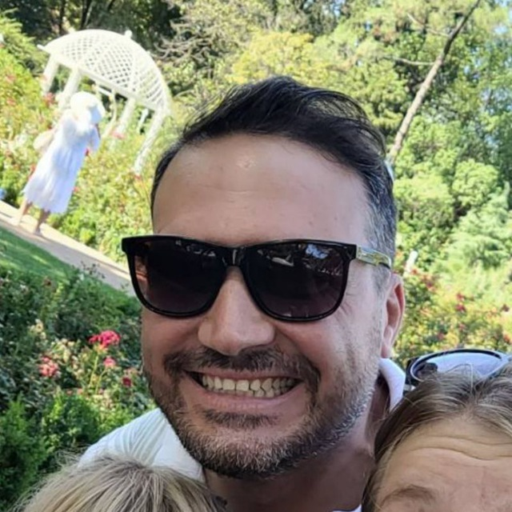

# Максим Мелешкин Инженер

## Обо мне:

Я начинающий программист. Обучаюсь в Нетологии по программе Python-разработчик: расширенный курс.

## Навыки:

Git - основы
Phyton - основы

## Проекты:

Своих проектов пока нет, не хватает знаний, но я над эти усиленно работаю.

### Контакты:

Email: maximmms@hotmail.com
Телефон: +7 (905) 658-45-14
Фотография: (
)
